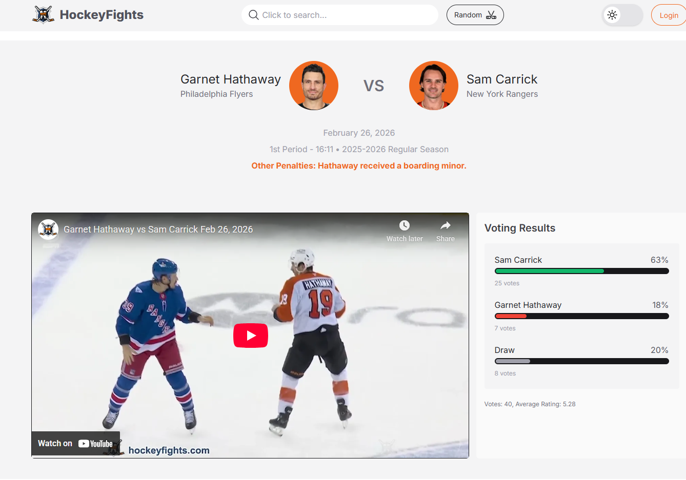
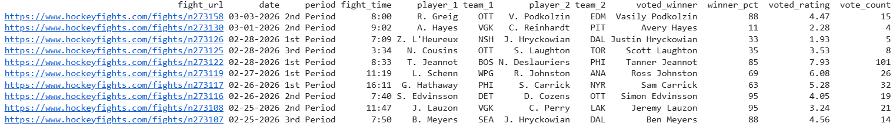
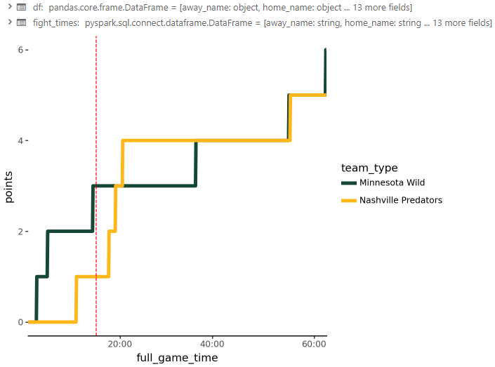
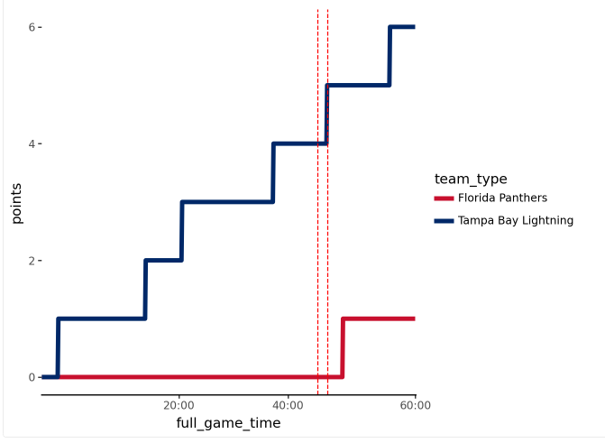
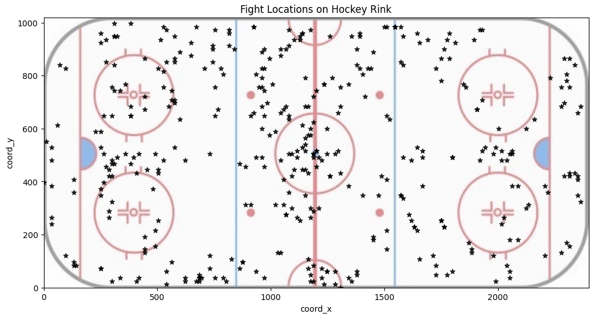

# Collecting and Cleansing Data

For my project, I am taking data from two sources to create a dashboard that gives insights into the effect of NHL fights. My goals for this project is to have a portion showing the most influential fights in the NHL.

Currently, most of my time has been dedicated to pulling the data together. So far the datasources I have pulled have been coming from two sources. The first, is the SportsRadar NHL API. Using the API, I was able to take game ID's for the every game of the 2025-2026 NHL season up until the olympic break. Using those ID's, I placed them in a list, and then called the play-by-play data for each game, compiling it into a single dataframe. This was the largest piece of the data collection and the most important because the play by play data is the only place to find where fights happened. Other pieces from the API include player and team data, which I will use to pull in player and team stats to add to the dashboard.

The second source I am using was gathered by some webscraping of the website hockeyfights.com. This website has a comprehensive list of every fight in the NHL, and I was able to pull the data for every fight, along with public poles of who the fans think won the fight. 

Now that I have majority of the data I will need, I have been in the process of cleansing and compiling all the data together. I have made a few seperate dataframes for different visualizations that will be included in the dashboard.

# Visualization

The first visualization I am made is to look at the chronological progression of each fight and the influence it has on the game. 

:::: {layout-ncol=2}

::::

Now that I have the chart working, all that has to happen to change the teams is change the filters for the dataframe to search by home, away, and date. I am hoping to add a dropdown menu to the dashboard that will allow users to select the teams and date of the fight they want to see, and this will auto update the graph.

The dates have been a bit of a struggle to wrangle, and so has been the process of picking out who is the home team fighter and away team fighter. This will be important when looking at the influence of the fight as well as looking at who is the most successful fighter. Once this is taken care of, I will be making a data frame that will count the number of goals scored before the fight, and the number of goals scored after the fight, and then calculating the difference to see if there was a positive or negative influence on the game. Using this method I will be able to rank the top most influential fights in the NHL, and then use that to create a leaderboard of the most influential fighters in the NHL.

Some other charts I have been able messing around with is a fight heat map to see where fights occur most frequently. That turned out to not have much correlation, but its a neat looking chart. 

