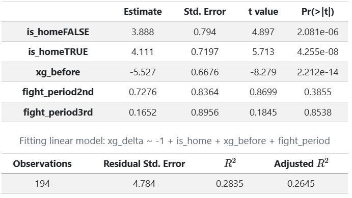
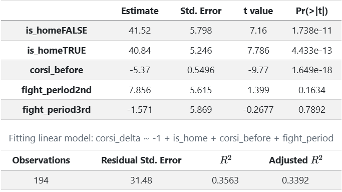
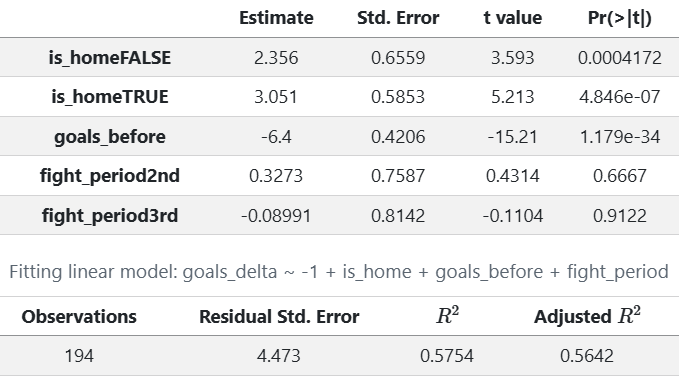
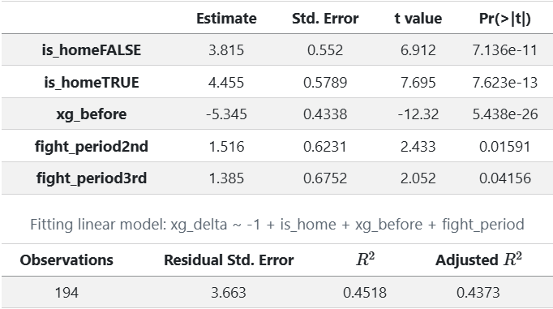
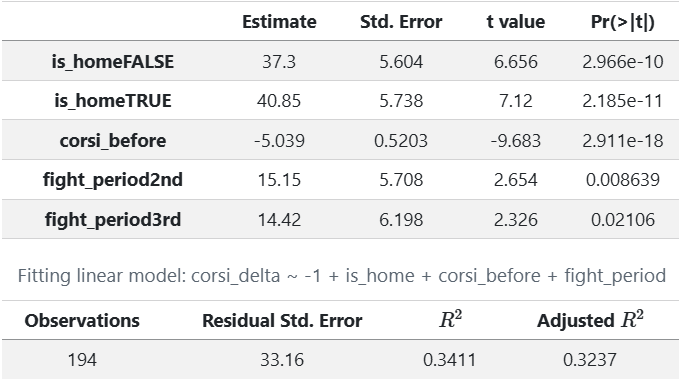
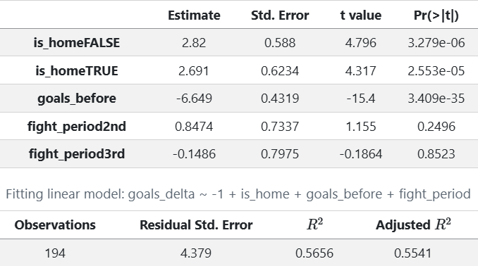
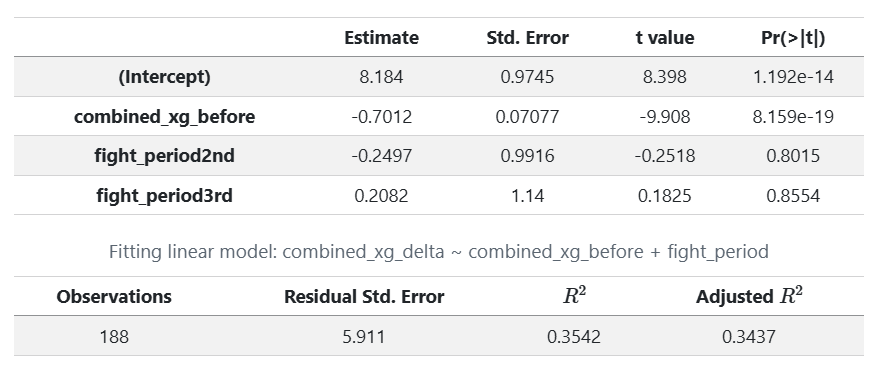

The origin of my project came on February 1st, 2026. I was watching the Tampa Bay Lighting play the Boston Bruins. The Lighting were down 5-2 in the middel of the second period when a fight broke out between Andrei Vasilevskiy and Jeremy Swayman. Following the fight between the two goalies , the lightning scored 3 goals in regulation to tie the game, and eventually win it in overtime. I couldn't help but think at the end of the game, was it the fight that sparked the comeback? Or was it just a coincidence that the fight happened right before the comeback?

In a earlier blog post I talked about the data cleansing processes I went through to get the data ready for analysis. Once it was cleaned, I still had to make a few more features to be able to start testing. The 3 main features I created to measure this influence is `xg_delta`, `corsi_delta`, and `goals_delta`. The `xg_delta` looks at the expected goals scored within 10 minutes before the fight, and then looks at the expected goals scored within 10 minutes after the fight, and then calculates the difference. The `corsi_delta` does the same thing but with corsi instead of expected goals. Corsi is a popular advanced stat in hockey that looks at all shot attempts, including missed shots and blocked shots, to give a better picture of puck possession. Lastly, the `goals_delta` looks at the actual goals scored before and after the fight.

Inside of these features, I also put in some ways to factor in dealing with when the fight takes place. A fight at the beginning of the game would have different impact from a fight at the end, so I added in "Per-60 Normalization".  Dividing by available seconds and multiplying by 3600 puts everything on a "per 60 minutes" scale so every fight window is comparable regardless of when in the game it happened. The before_seconds and after_seconds columns handle this, and you floor them at 1 second to avoid dividing by zero.

Performing these tests in R, I created a linear regression model that looked added in factors such as is the fight at home or away for the winner or loser, what was the xg/corsi/goals before for the fighters team, and what period did the fight take place in. I ran this model separately for the winner and loser of the fight to see if there was a difference in influence for the winner vs the loser.

Here are the results of each test.

### Winner of the fight ~ xg_delta

### Winner of the fight ~ corsi_delta

### Winner of the fight ~ goals_delta

### Loser of the fight ~ xg_delta

### Loser of the fight ~ corsi_delta

### Loser of the fight ~ goals_delta

## Conclusion 1

The main thing we see over all 6 models is the fact that the reigning factor is the _before variable. There is distinct regression towards the mean for both teams inn every statistical category. But something we can see is an general offensive pick up from both teams, regardless of winning or losing. To be sure of this, I recombined the data to include both winners and losers. The results of those tests were quite significant. 

### Overall Game ~ xg_delta

### Overall Game ~ corsi_delta

### Overall Game ~ goals_delta

Controlling for how both teams were already playing and what period the fight happened in:

xG: Combined expected goals rate goes up 8.2 per 60 after a fight
Corsi: Combined shot attempts go up 72 per 60 after a fight
Goals: Combined goal rate goes up 5.8 per 60 after a fight

All three are highly significant (p < 0.001). Fights systematically increase the offensive pace of the game for both teams combined, regardless of who won, what period it was, or how the game was already going.

So boys, drop the gloves, and lets get the rink rocking!
